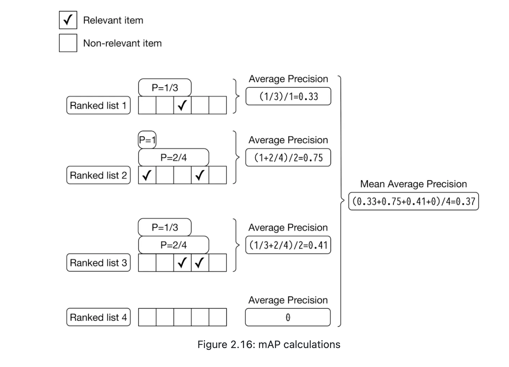
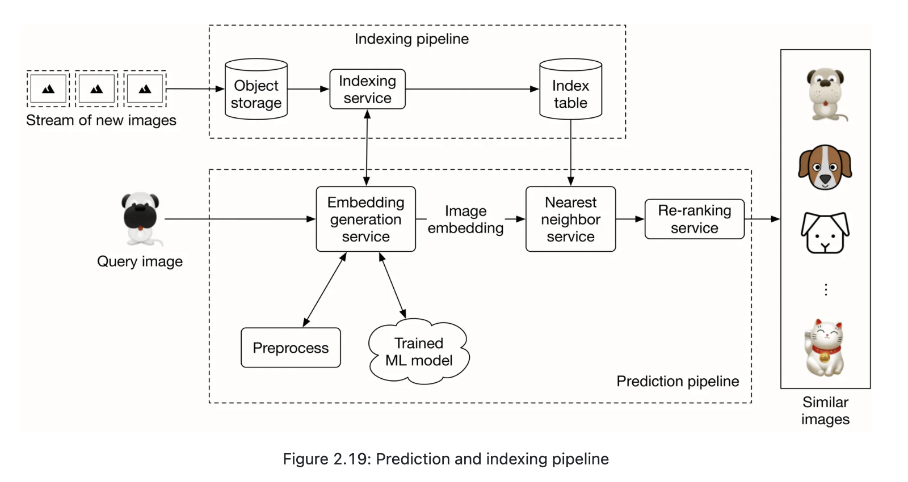

- Business Objective: Visual Search
	- Input: image
	- Output: a set of similar images
- ML Objective:
	- Visual search -> ranking problem
	- Representation learning - embeddings: mapping images into N-dim space
- Data preparation
	- Data available
		- Images - metadata of image
		- Users - user information
		- User-Image interactions
			- UserID | QueryImageID | DisplayedImageID | PositionInDisplayedList | InteractionType | Location | Timestamp
	- Feature engineering
		- resizing
		- scaling
		- z-score normalization
		- Consistent color mode - RGB / CMYK
- Model Development
	- Model Selection
		- NN
		- CNN
			- Image vector -> Embedding vector -> ConV -> FCs -> 
			- batch x vector_len(K) x 1 
		- ViT
		- Model 
			- vector store in database
		- approaches
			- production从大训练，优化
				- ? activation
				- ? FC layers
	
	- Model Training
		- contrasive training
			- 1 Positive sample: one similar image
				- ? how to get positive samples?
					- human label
						- Pros: accurate
						- Cons: expensive | time costly
					- User interactions
						- Pros: no manual work
						- Cons:
							- noisy - click might not be similar
							- sparse data - most image won't have click
								- ? what it we only use clicked data?
									- imbalance image types, need consider
					- Augmentation - self supervised
						- ? SimCLR Framework
							- Simple Framework for Contrastive Learning of Visual Representations
							- Steps
								- Data augmentation: generate two correlated, but distinct images - crop/resize/color distortion / flipping
								- Feature extraction
									- CNN convert into vector embeddings
								- Projection Head - use FC map to contrastive loss
								- Loss calculation
			- N Negative Samples: dissimilar images, usually N == 2,3
				- ? How to get negative samples?
					- random choose from population - unlikely to be similar
			- ? How to deal with data imbalance: different types might have different number of samples, popular image types would dominate negative samples:
				- down-sampling hot types
				- up-sampling cold image types
		- Loss Function
			- Process: `[E1, E2...Ei]` -> Cross cosine similarity / or dot prod -> Softmax -> CrossEntropy Loss by real labels
			- Encourage similar images with high cos, while dissimilar images with low cos
		- ? How batch training
			- each batch has N pairs, with 1 positive sample and N-1 negative samples, N = 2,3
			- we can have more small batches to build one large batch
- Evaluation
	- Offline Metrics
		- Mean reciprocal rank (MRR)
			- Rank of the first correct answer
			- Useful when order of results is important
			- Calculation
				- Given a set of queries Q and rank of the first relevant answer as `rank_i`
				- Reciprocal rank: $\frac{1}{rank_i}$
				- $$MRR = \frac{1}{|Q|} \sum_{i=1}^{|Q|} \frac{1}{rank_i}$$
				- Explain:
					- MRR = 1: ideal, the first result is always the relevant answer for every query
					- MRR = 0: never returns a relevant result in top position
					- MRR > 0: relevant results are returned, not always as first result
			- Pros
				- Simple
				- Focus on first success in most scenarios (e.g.: clicking the first search result) - align with user satisfaction
			- Cons
				- Do not account for all relevant items
				- Not sensitive to position of other relevant items
					- e.g.: model1 outputs `[0, 1, 1, 1]` and model2 outputs `[0, 1, 0, 0]` though model1 gives more relevant items, both get scores 0.5
		- Recall @ k
			- Proportion of relevant items found in top-k results (sensitivity)
			- Definition
				- R: set of all relevant items for q - ground truths
				- $R_k$: set of all relevant items retrieved by the system in the top-k results
				- $$Recall@k = \frac{|R_k|}{|R|}$$
				- Explain
					- $Recall@k = 1$: all relevant items are retrieved within top-k results - ideal
					- $Recall@k = 0$: None of relevant items are retrieved - poor performance
					- $Recall@k < 1$: proportion of true relevant items are found
			- Pros
				- Sensitivity will increase user satisfaction
			- Cons
				- Not sensitive to rank - only show on top-k result
				- R could be very large, making Recall small
				- Dependent on K
		- Precision @ k
			- Fraction of retrieved items that are relevant to the query out of the top K results
			- Definition:
				- $R_k$ - set of relevant items retrieved in top-k results
				- K - total number of items in top-k results - a fixed number
				- $$Precision@K = \frac{|R_K|}{K}$$
				- Pros
					- Measures relevance of result - user satisfaction
				- Cons
					- Do not consider order / rank of results - within K, ranking top or lower won't make any difference
		- Mean average precision (mAP)
			- Used for binary relevances: each item is either relevant or irrelevant
            - 
			- Definition
				- ? $AP = \frac{\sum_{i=1}{k}Precision@i\text{ if ith item is relevant}}{\text{total relevant items}}$
				- ? $AP = \frac{\sum_{i=1}{k}Precision@i\text{ if ith item is relevant}}{\text{total relevant items in the list}}$
				- $$MAP = \frac{1}{|Q|}\sum_{q=1}^{|Q|}AP_q$$
				- Cons: 
					- not ideal when relevant scores are continuous
					- equal weight to all ranks - in practice, user expectations where higher-ranked items are more important
					- Sensitive to number of queries |Q| and query variations
		- Normalized discounted cumulative gain (nDCG)
			- accounts for position / rank in result list - assigns higher importance to items at top
			- DCG: discounted cumulative gain
				- $rel_i$: ground truth relevance score of image ranked at location i
				- (i+1): discount factor - higher rank contribute more to the score
				- $$DCG_p = \sum_{i=1}^{p}\frac{rel_i}{log_2(i+1)}$$
			- nDCG: normalized DCG to ensuer it is within a consistent range
				- IDCG: sorting all relevant items in the corpus by relevance in descending order and then computing the DCG at position $n$ for this ideal ranking.
				- $$nDCG_p = \frac{DCG_p}{IDCG_p}$$
				- Example
					- System output result list:`items = [item0, item1, item2, item3 item4]`
					- Ground Truth rank of each item: 
						- `rel_scores = [0,5,1,4,2]`
						- ? How do we get ground truth data here?
					- $DCG_p = \frac{0}{log_2(2)} + \frac{5}{log_2(3)} + \frac{1}{log_2(4)} + \frac{4}{log_2(5)}+ \frac{2}{log_2(6)} = 6.151$
					- $IDCG_p = \frac{5}{log_2(2)} + \frac{4}{log_2(3)} + \frac{2}{log_2(4)} + \frac{1}{log_2(5)}+ \frac{0}{log_2(6)} = 8.9543$
					- $nDCG_p = \frac{DCG_p}{IDCG_p} = 0.6869$
				- Explain:
					- **nDCG = 1**: The ranking perfectly matches the ideal ranking, with the most relevant items appearing first.
	- Online Metrics
		- CTR: how often users click on the displayed items
			- $$CTR = \frac{clicks}{\text{Exposures}}$$
			- Exposure here is total number of suggested images
- Serving
	- pipeline
		- 
		- Offline: 
			- Object storage (Images) -> indexing service (vector DB)
		- Online:
			- Query image -> Embedding Model -> Vector -> Sim search in vector DB
	- Indexing service - vector DB
	- Nearest Neighbour
		- Exact NN
			- each query takes O(N x D)
		- ANN
			- Tree-based ANN: partition by attribute, e.g.: gender
				- K-D Tree
				- R-Trees
			- LSH(Locality sensitive hashing)
				- bucketing by hash
			- Clustering based ANN
		- ML Coding Interview:
			- implement NN

# Questions
- moderate images?
- cold start?
- how frequent do we update vector DB and models?
		- How to catch most recent query trend? - latest news, latest images
			- Mixed result by batch and online models?

# Coding
Write the code to train the model given images